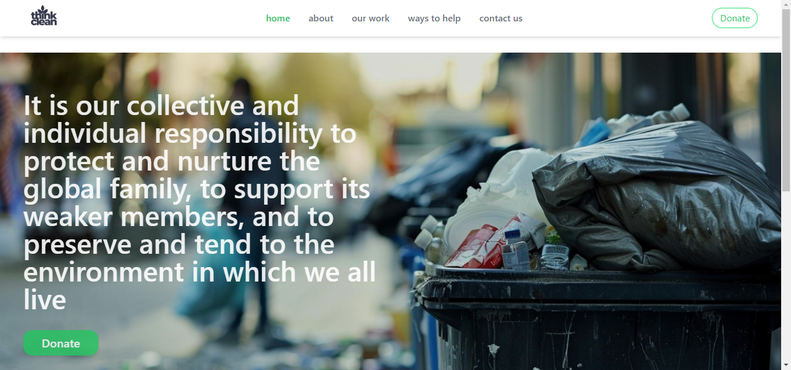
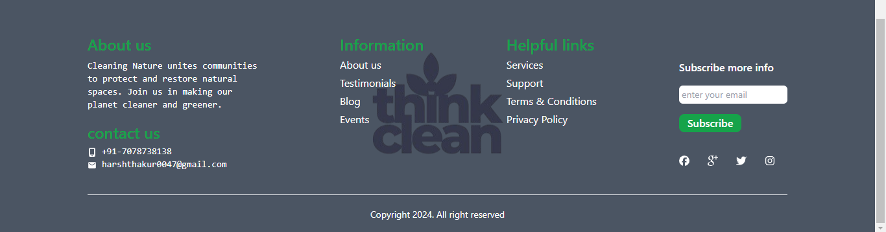

# Think Clean

Think Clean" is a web application currently in development, designed to organize cleaning drives and provide valuable information on environmental cleaning practices. Built with React, HTML, Tailwind CSS, and Redux, it aims to promote community involvement and educate users on effective ways to maintain a clean environment.

## Technologies Used

1. React
2. HTML
3. Tailwind CSS
4. Redux

## Features

1. Organize Cleaning Drives: Plan and schedule community cleaning events.
2. Educational Resources: Provide information and tips on environmental cleaning practices.
3. Interactive Interface: User-friendly design for easy navigation and engagement.

## Screenshot

